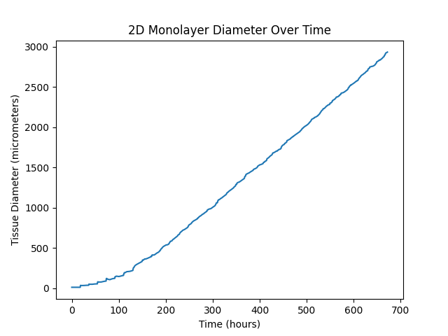
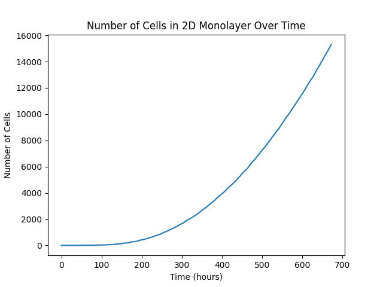
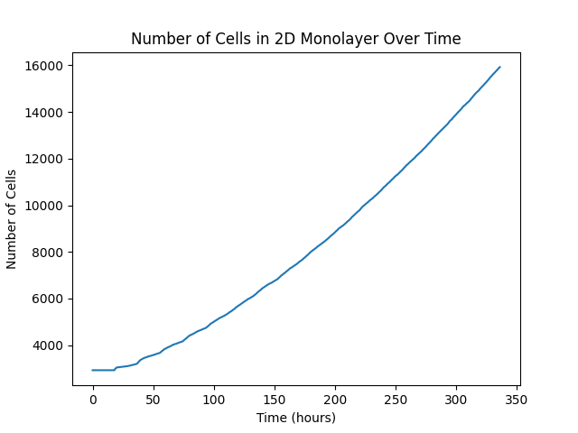

# PerMedCoE Observatory Unit Tests

See also https://github.com/Chaste/Chaste/issues/166.

## General Comments

* All of the unit tests, as currently specified, are unnecessarily ambiguous. Physicell results are included in more results figures than any other tool and the code for their results is here: https://github.com/PerMedCoE/observatory_benchmark/tree/main/multiscale_benchmark/2022_09_hackathon/Physicell
 
## Cell Cycle - Fixed Duration

* The unit test specification does not unambiguously describe how to specify the cell volume as a function of time, based on the [experimental dataset](https://github.com/PerMedCoE/observatory_benchmark/blob/main/multiscale_benchmark/2022_09_hackathon/experimental_data/unit_test_cellcycle/Flow%20Cytometry%20Cell%20Cycle%20volume%20dynamics.txt) provided. To improve comparison across tools, more detail is needed; ideally, Arnau should either specify cell volume as a function of time, or specify how the data should be interpolated over time (e.g. piecewise linearly).
* Figure 2.1.2.b on page 14 of the [benchmarking report](https://drive.google.com/file/d/1bgpD29n1Wr-scJkfA8KehB2m3UyFOBeB/view?usp=drive_link) does not reflect the Chaste results recorded in the [github repo](https://github.com/PerMedCoE/observatory_benchmark/blob/main/multiscale_benchmark/2022_09_hackathon/Chaste/unit_test_cellcycle/results/cellcycle_fixed.png). Can Arnau update this?
* Numerical values used to relate cell volume to age were fit from the [experimental dataset](https://github.com/PerMedCoE/observatory_benchmark/blob/main/multiscale_benchmark/2022_09_hackathon/experimental_data/unit_test_cellcycle/Flow%20Cytometry%20Cell%20Cycle%20volume%20dynamics.txt) using the procedure in the Python script below:
  
```python
# scipy version: 1.11.3
from scipy.optimize import curve_fit

def func(x, a, b, c):
    return a * x * x + b * x + c
    
relative_volume = [
101.9551018, 107.9604984, 115.3709399, 123.3029321, 131.2110512, 138.7731663, 145.8130126, 152.2481633,
158.0552476, 163.2468548, 167.856337, 171.9279316, 175.5104538, 178.6533687, 181.4044384, 183.8084021,
185.9063225, 187.7353554, 189.3287777, 190.7161688, 191.9236745, 194.6832014, 195.3745722, 195.9758402]

time_mins = range(0, 30*len(relative_volume), 30)
popt, pcov = curve_fit(func, time_mins, relative_volume)
print(popt)
```

## Cell Cycle - Stochastic Duration

* Similar issues to those raised above.
* The unit test specification does not unambiguously define the stochastic model of cell cycle progression. To improve comparison across tools, more detail is needed; ideally, Arnau should specify whether the cell cycle phase durations are independent random variables.
* The results seem to be based on a single stochastic simulation performed with each tool. To improve comparison across tools, summary statistics should instead be plotted, e.g. mean +/- standard deviation, based on say 10 simulations.

## Diffusion - Single Cell Sink

* We are working towards an implementation of this unit test in Chaste.
* The unit test specification does not unambiguously define the initial condition. Should c(x, 0) be 10 everywhere in the domain, 0 everywhere in the domain, or 10 everywhere in the domain except at the very centre? What is the spatial extent of the sink term? What discretization is required in the case of FEM? These aren't clear as currently described.
* There is no definition of \lamba (= 20uM/0.01min) in the unit test - what is this parameter? It might be helpful to spell out the unit test mathematically.

## Diffusion - 1k Cells as Sinks

* We are working towards an implementation of this unit test in Chaste.
* Similar issues to those raised above.
  
## Mechanics - Movement of a Cell with Friction

* Now implemented in Chaste.
* For this unit test in particular, it would be good to see the Physicell code so we can work out precisely how they interpreted the unit test specification, so that we can do something as close as possible.
* Figure 2.1.2.e on page 17 of the [benchmarking report](https://drive.google.com/file/d/1bgpD29n1Wr-scJkfA8KehB2m3UyFOBeB/view?usp=drive_link) seems to be a plot of velocity against time, not distance moved against time as claimed. Can Arnau check this?


  
## Mechanics - Two Cells Pushing Each Other

* Now implemented in Chaste.


## One Cell with Chemotaxis

## Use Case - 2D Monolayer without Diffusion

* Now implemented in Chaste
* Results available in tissuewidth.dat. Format is `time    min_x, max_x, tissue_diameter, number_of_cells`

### Single Cell



Tissue exhibits an initial period of faster than linear growth, before reaching a linear stage in agreement with the provided data. Absolute values for tissue diameter are comparable.

### Multiple Cells



Tissue exhibits linear growth and comparable growth rate.

## Use Case - Spheroid without Diffusion

## Use Case - Spheroid with Diffusion
